# **StyleRadar**
StyleRadar es una plataforma web que conecta compradores con almacenes de moda locales. Los almacenes publican su inventario (fotos, tallas y disponibilidad) y el usuario puede buscar prendas, consultar tiendas cercanas y probarlas virtualmente con IA. También permite publicar ropa usada para vender o donar a una fundación aliada.
StyleRadar no es un marketplace: es el puente entre la intención de compra digital y la tienda física.

### Cómo levantar el proyecto localmente

1. Descarga o clona el repositorio con el comando `git clone https://github.com/CatrachoINXS/StyleRadar-Backend.git` 
2. Dirigete al directorio donde clonaste el repositorio e ingresa a la carpeta del proyecto `(.../StyleRadar-Backend/style-radar)` y en la terminal ejecuta `mvn clean compile` para compilar el proyecto.
3. Ingresa el comando `mvn spring-boot:run` para ejecutar el proyecto.
4. Una vez iniciado, estará disponible en el puerto configurado. 

## Diagrama de Contexto

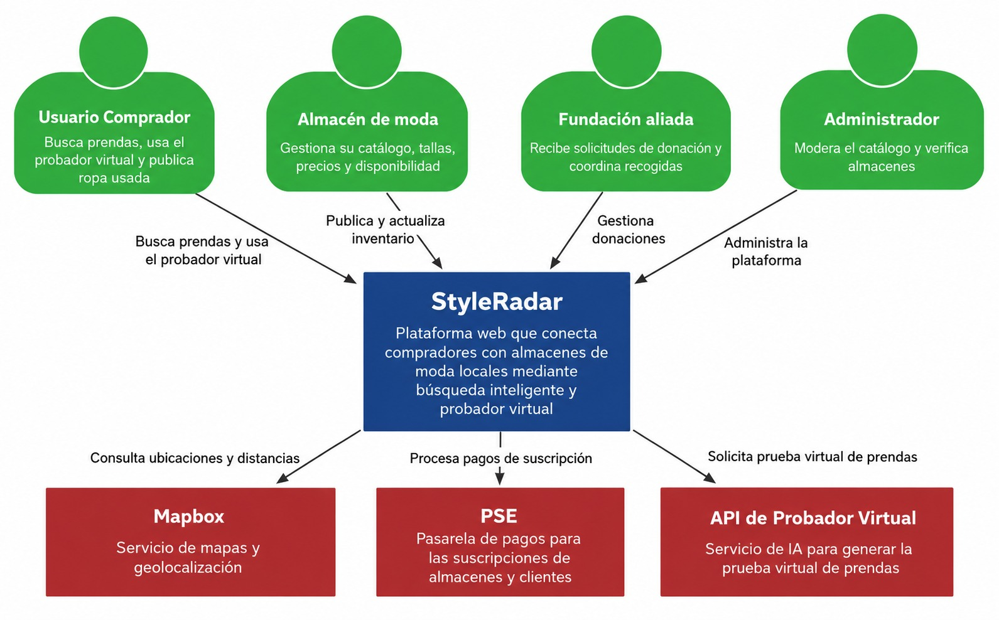

## Diagrama de Componentes General

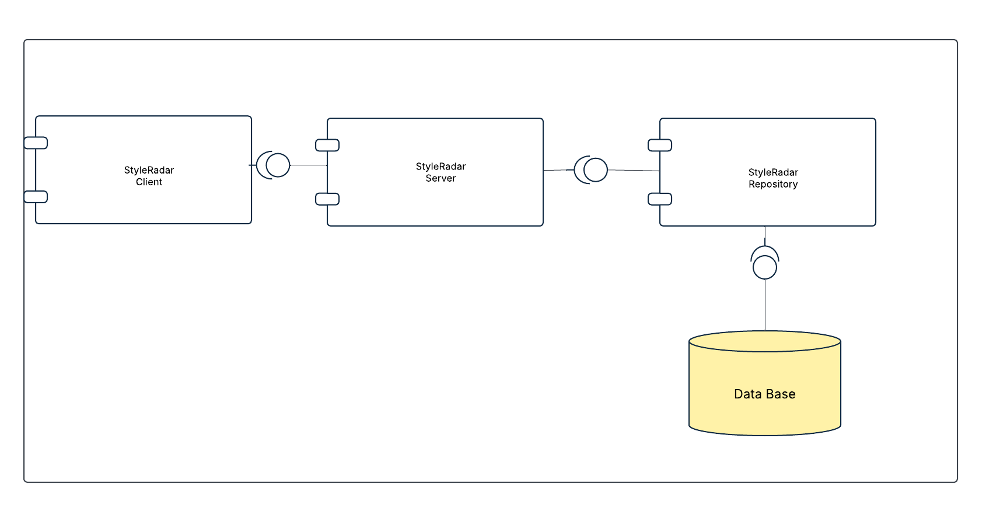

## Diagrama de Componentes Especifico

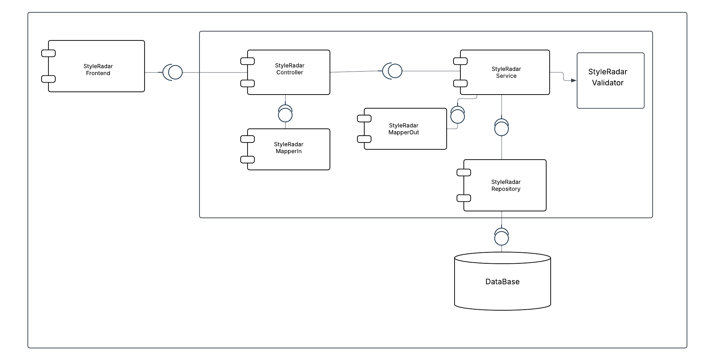

## Diagrama de Clases
En el siguiente diagrama de clases se pueden observar los objetos del dominio así como sus interacciones.

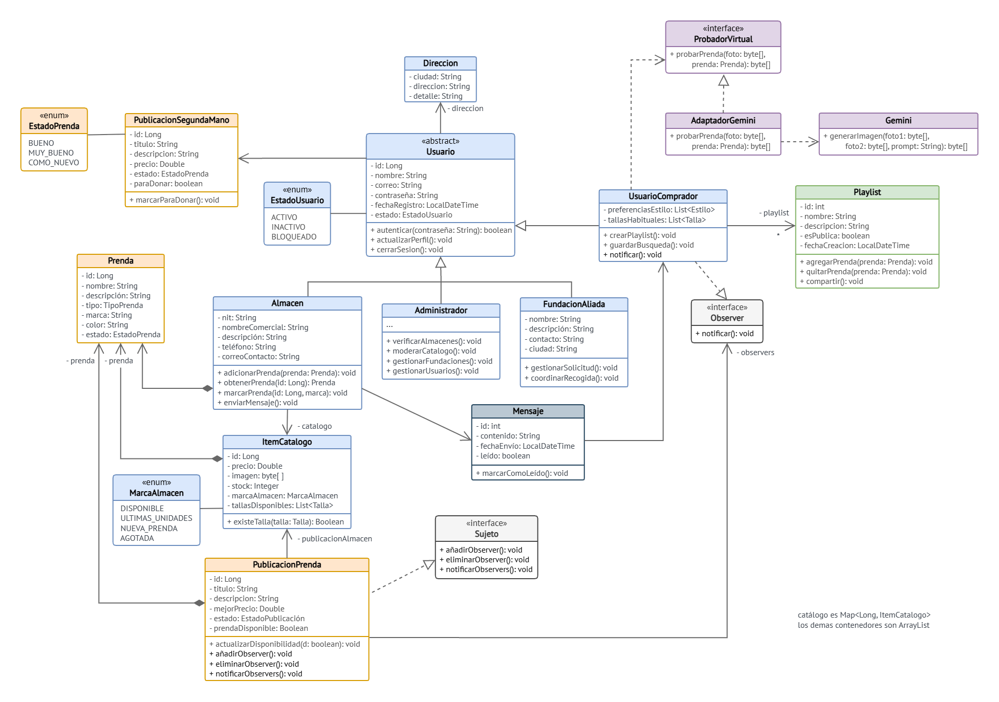

## Justificación Patrones de Diseño

### Patrón Strategy
El patrón Strategy en el contexto de StyleRadar resuelve el problema de tener algoritmos de sugerencia para el feed que deben ser intercambiables según las preferencias del usuario. Sin este patrón, la clase encargada de administrar dichos algoritmos estaría acoplada a cada uno de ellos, lo que dificultaría su extensión y dejaría el código abierto a modificaciones que podrían romper su funcionamiento.

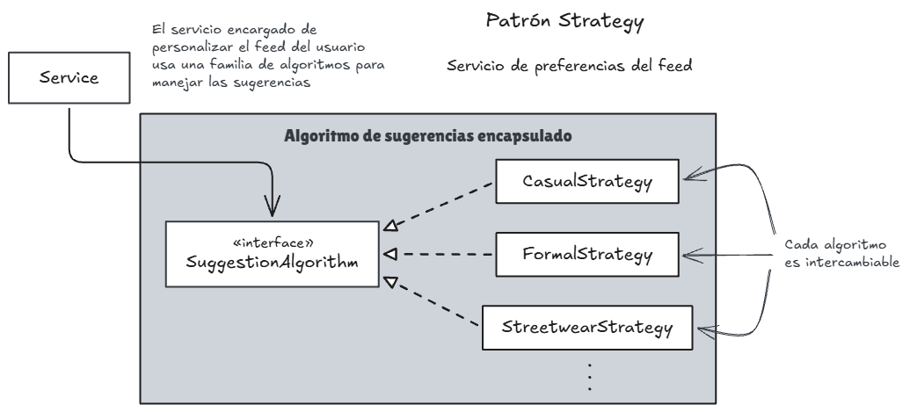

El lugar donde vive este patrón es ... (Pendiente por completar). 

### Patrón Observer

El patrón Observer resuelve el problema de notificar automáticamente a los usuarios suscritos a la publicacion de una prenda cuando un almacen aliado sube una unidad.

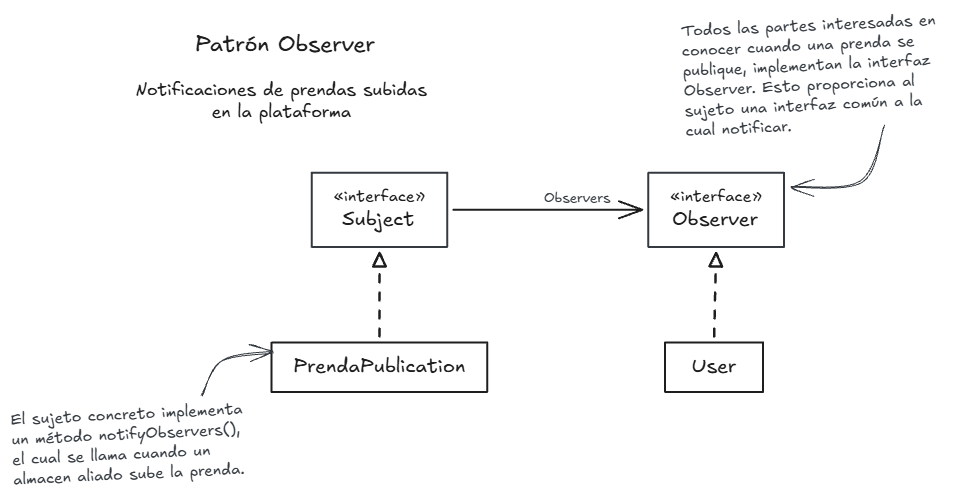

El lugar donde vive el patrón Observer es en el dominio, específicamente en la clase `PublicaciónPrenda` quien es el sujeto y la clase `UsuarioComprador` quien es el observador notificado cuando se sube una prenda a la publicación.

Así se ve el patrón en el diagrama de clases:

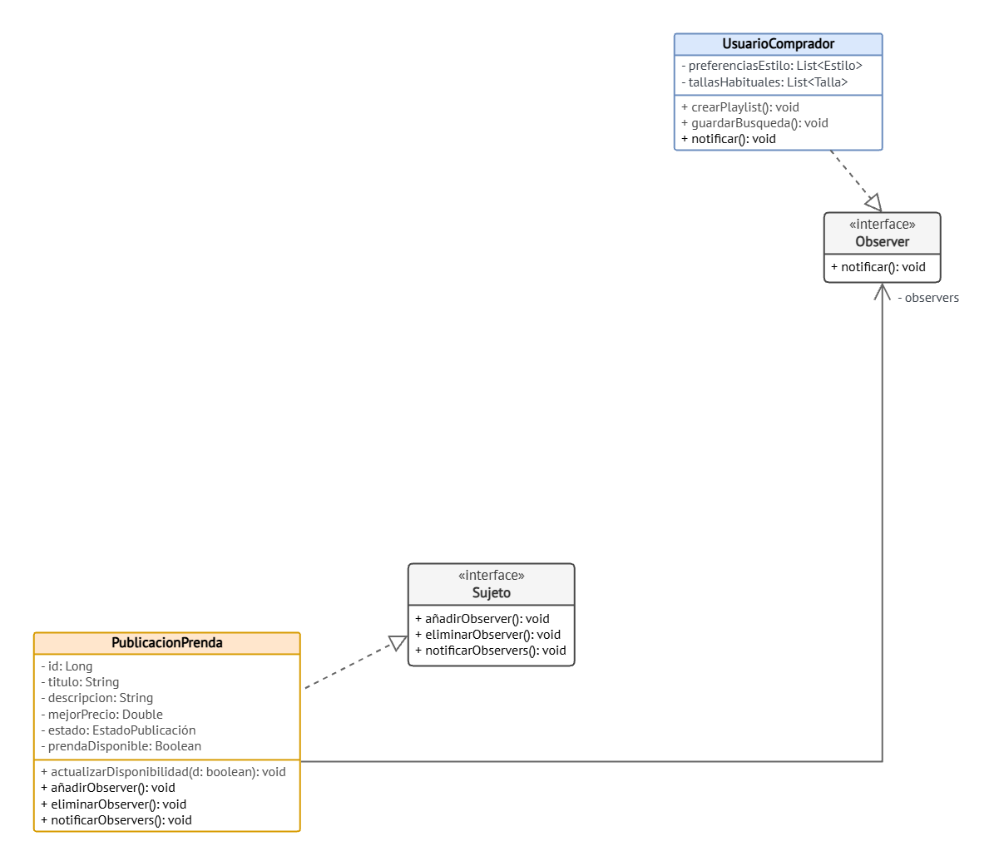

### Patrón Adapter

El patrón adapter nos resuelve dos problemas. El primero de ellos es la compatibilidad con diferentes pasarelas de pago; usando este patrón podemos usar una interfaz común de pagos en nuestro sistema para adaptar las pasarelas de pago externas.

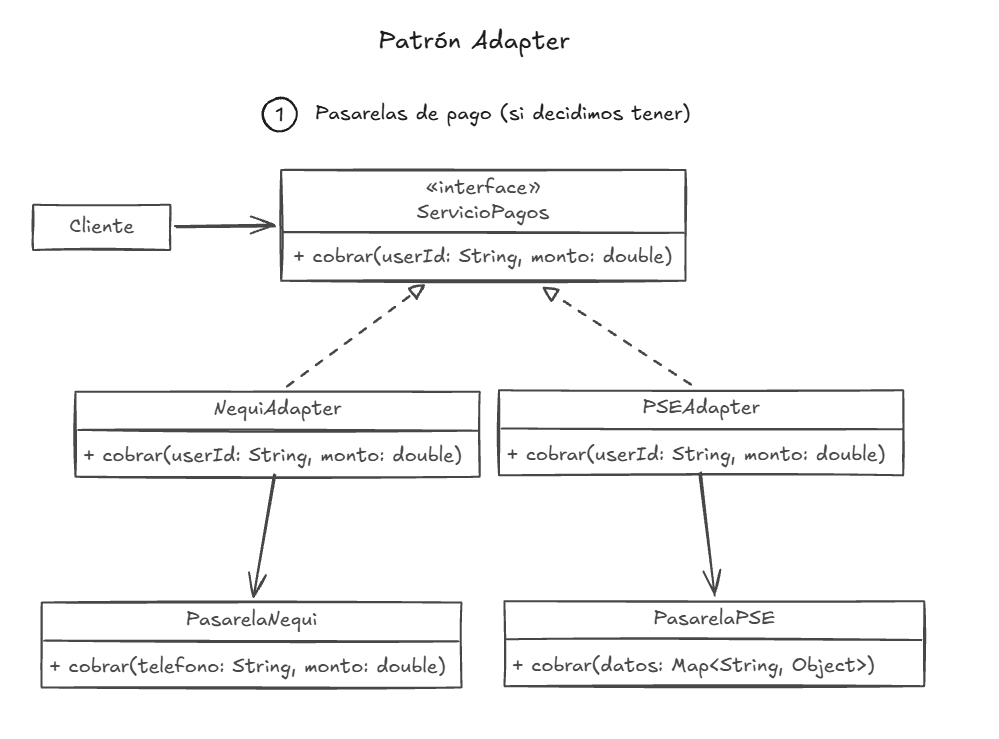

El segundo problema que resuelve es la compatibilidad con la Inteligencia Artificial utilizada para el probador virtual de prendas. Usando Adapter podemos integrar la interfaz de cualquier IA con nuestro sistema sin necesidad de acoplarla.

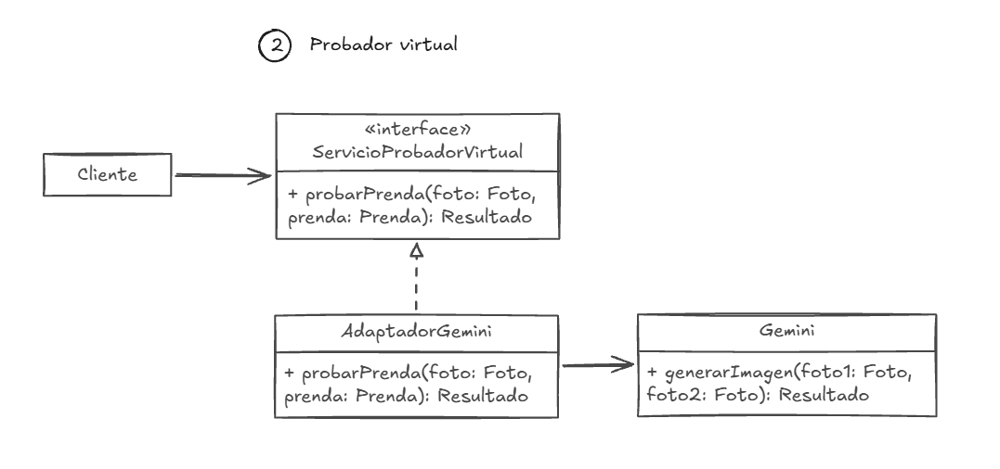

El lugar donde vive el patron adapter es el dominio, específicamente en las clases `ProbadorVirtual` y `AdaptadorGemini`.

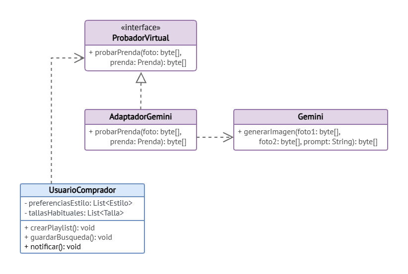

### Patrón Composite

El patrón composite nos resuelve el problema de la combinacion de filtros en las búsquedas inteligentes. Con este patrón podemos crear filtros simples como FiltroTalla o FiltroColor, y filtros complejos como FiltroCompuestoAnd (que combina dos filtros) y tratarlos de la misma forma. De esta forma, evaluar si una prenda cumple con un filtro de búsqueda complejo, se vuelve más sencillo. 

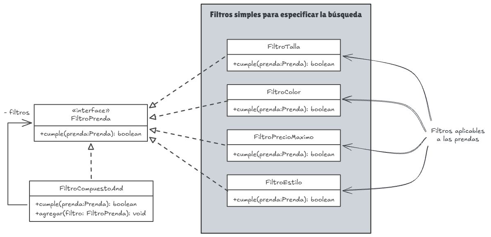

El lugar donde vive el patron composite es...(Pendiente por completar)

### Patrón Iterator

El patron iterator por otro lado nos resuelve el problema de recorrer la colección de prendas durante la búsqueda inteligente usando filtros, pero sin exponer el contenido de las prendas. Usando este patron podemos iterar sobre los elementos y recolectar solo aquellas que cumplan con determinado filtro.

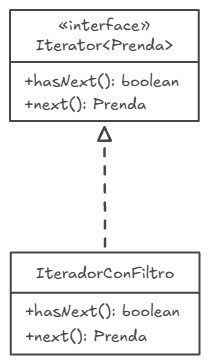
