# StyleRadar

StyleRadar es una plataforma web que conecta compradores con almacenes de moda locales. Los almacenes publican su inventario —fotografías, tallas y disponibilidad— y los usuarios pueden buscar prendas y consultar tiendas cercanas. El producto general también contempla experiencias como el probador virtual, la venta de ropa usada y las donaciones.

StyleRadar no es un marketplace: es el puente entre la intención de compra digital y la tienda física.

## Backend Sprint 2: catálogo y búsqueda

### Requisitos

- Java 21.
- Maven.
- PostgreSQL.

### Configuración local

La aplicación obtiene la conexión a PostgreSQL exclusivamente de estas variables de entorno:

- `DB_URL`: URL JDBC, por ejemplo `jdbc:postgresql://localhost:5432/styleradar`.
- `DB_USERNAME`: usuario de la base de datos.
- `DB_PASSWORD`: contraseña de la base de datos.

No se deben versionar credenciales reales. Desde la carpeta `style-radar/` se pueden ejecutar:

```shell
mvn clean test
mvn clean verify
mvn spring-boot:run
```

`mvn clean verify` ejecuta las pruebas y la regla de cobertura JaCoCo configurada en el proyecto.

### Swagger/OpenAPI

Con la aplicación en ejecución, la interfaz y el documento OpenAPI están disponibles en:

- `/swagger-ui.html`
- `/v3/api-docs`

Las interfaces del paquete `controller/docs` describen únicamente los endpoints implementados de prendas, catálogo, inventario, imágenes y búsqueda.

### Arquitectura implementada

El módulo mantiene una separación por responsabilidades:

1. Los `Controller` atienden HTTP y delegan la conversión de contratos a los mappers de presentación.
2. El modelo de `Domain` representa los datos usados por los casos de uso.
3. Los `Service` coordinan reglas, validadores y operaciones del módulo.
4. Los `Validator` y calculadores contienen reglas específicas de inventario, estados, distancia y similitud.
5. Los mappers de persistencia convierten entre dominio y entidades JPA.
6. Los `Repository` acceden a PostgreSQL mediante Spring Data JPA.
7. Las `Entity` representan tablas, restricciones y relaciones de persistencia.

El flujo habitual es `Controller -> Mapper -> Domain -> Service -> Validator -> Persistence Mapper -> Repository -> Entity -> PostgreSQL`; los casos simples omiten capas que no aportan transformación o reglas.

### Alcance implementado por este backend

- Publicación, consulta, edición y retiro de ítems del catálogo de un almacén.
- Inventario por talla y cálculo derivado del stock disponible.
- Registro de múltiples imágenes y respuesta basada en metadatos.
- Cálculo de estados: agotada, últimas unidades, nueva prenda y disponible.
- Búsqueda global con texto libre, filtros combinados y paginación.
- Orden por distancia y reputación del almacén.
- Fallback de prendas similares cuando una búsqueda textual no tiene coincidencias directas.

### Pruebas y calidad

La suite utiliza JUnit, Mockito y H2 para pruebas unitarias, web y de persistencia. JaCoCo mide cobertura de líneas y ramas durante `mvn clean verify`; el build exige una cobertura de líneas global mínima del 85 %. El perfil `test` permite validar el contexto Spring sin depender de una instancia PostgreSQL externa.

## Diagramas académicos

## Diagrama de Contexto
En el siguiente diagrama de contexto se presenta la arquitectura general y los actores que interactúan con StyleRadar.

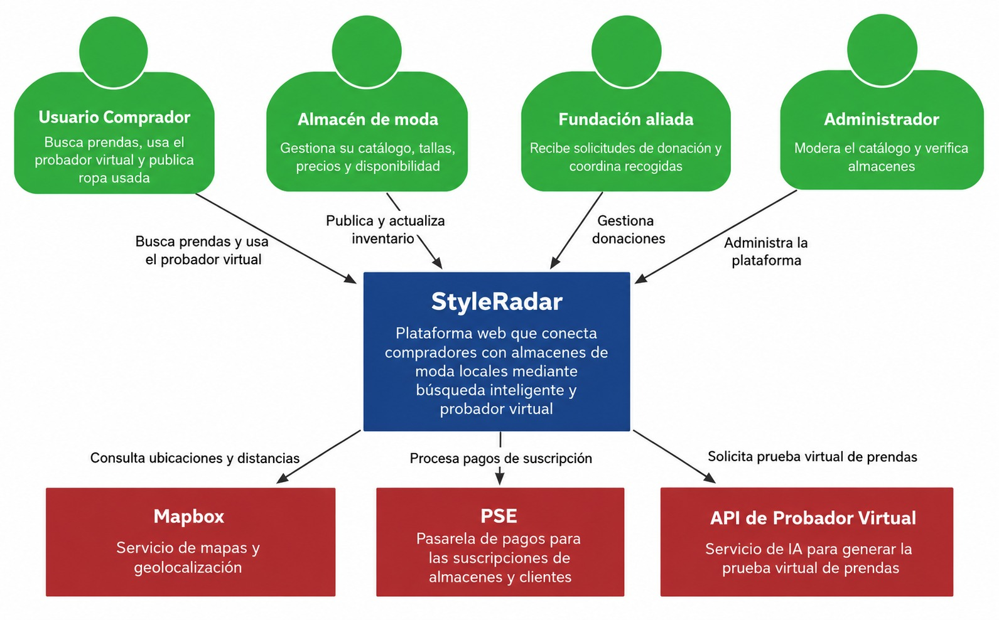

### Actores
Como actores tenemos a los *usuarios compradores, a los almacenes de moda, a las fundaciones aliadas y al administrador*.

Cada uno de los susodichos interactúa de manera diferente en la plataforma, tal y como se menciona en el diagrama.

### Sistemas externos
Como sistemas externos están *Mapbox* para que los usuarios compradores puedan saber a donde tienen que ir para comprar su prenda. *PSE* como pasarela de pagos para las suscripciones y la *API del Probador Virtual* que se conecta a un servicio de IA para generar una imagen del usuario comprador con determinada prenda.


## Diagrama de Componentes General
El siguiente diagrama de componentes muestra la arquitectura general del sistema, dividida en tres partes principales.

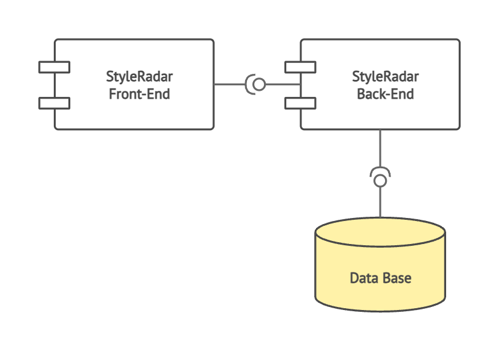

La primer parte es el ***Front-End*** que representa la interfaz de usuario con la que interactuan todos los actores. La segunda parte es el ***Back-End***, encargado de toda la lógica de negocio y de proveer la interfaz para que sea utilizada por el front. La tercera parte es la ***Base de Datos***, componente encargado de persistir la información de la plataforma y de proveer la interfaz para el back.

## Diagrama de Componentes Especifico
Este diagrama de componentes específico muestra la arquitectura interna del Back-End de StyleRadar. En él tienen cinco módulos explicados a continuacion.

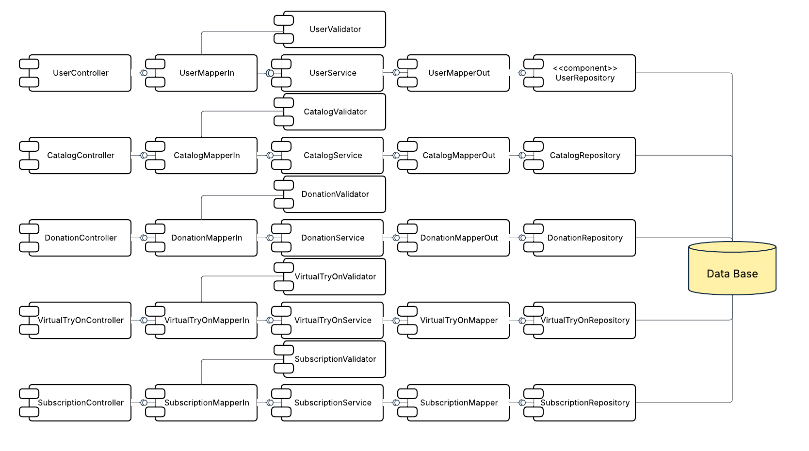

### Módulos
Cada módulo se encarga de una parte específica de la plataforma. 
- **Usuarios:** Gestiona y valida la información de los usuarios. 
- **Catálogo:** Para administrar el inventario y prendas que suben los almacenes a la plataforma.
- **Donaciones:** Maneja todo lo relacionado con las donaciones de prendas para las fundaciones aliadas.
- **Probador virtual:** Maneja la lógica con la herramienta IA para que los usuarios compradores puedan probarse las prendas virtualmente.
- **Suscripciones:** Se encarga de los planes de los usuarios compradores y los almacenes administrando los pagos.
  
### Estructura de los módulos
En cáda módulo los componentes interactuan de la siguiente manera: Un actor envía una solicitud y esta llega al `Controller`. Este transfiere los datos a un `MapperIn` para transformarlos en objetos `DTO` y enviarlos al `Validator`, el cual comprueba que se cumplan todas las reglas de negocio. 

Después de la verificacion se pasa la informacion al `Service`, quien contiene toda la lógica de negocio e interactua con los objetos de dominio. Despues de ello, se pasa al `MapperOut` para transformar la informacion y pasarla al `Repository`, el cual se encarga de la comunicación con la base de datos.

Al final, todos los repositorios de cada módulo llegan a la base de datos, para almacenar y recuperar la informacion cuando se requiera.

## Diagrama de Clases
El diagrama existente es un artefacto académico que debe actualizarse manualmente para reflejar el código vigente del Sprint 2.

En el siguiente diagrama de clases se pueden observar los objetos del dominio, se muestran las entidades principales, sus atributos y las interacciones que conectan el sistema.

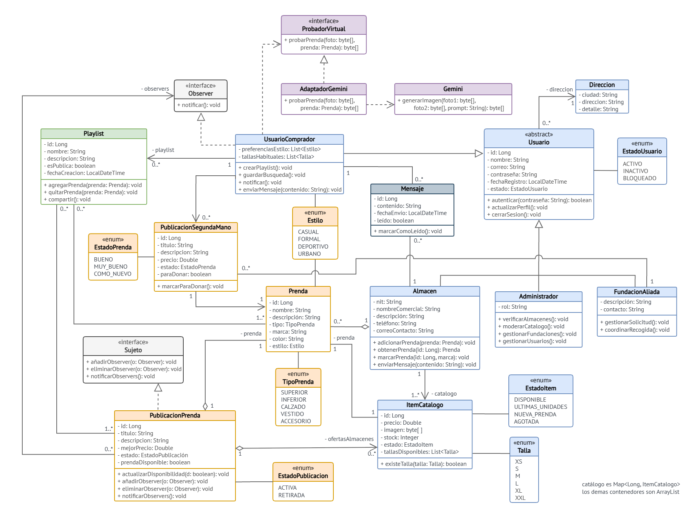

### Estructura general del diagrama de clases
En el diagrama se observa en color azul todo lo relacionado con la gestión de usuarios, perfiles y catálogos de almacén. Se encuentra la clase abstracta `Usuario`, de la cual heredan los diferentes tipos de actores: el `UsuarioComprador`, el `Almacen`, el `Administrador` y la `FundacionAliada`. Además, incluye clases auxiliares como `Direccion`, `Mensaje` y una enumeración con los estados del usuario.

En color amarillo se agrupa lo referente a las prendas, con la clase `Prenda` y sus enumeraciones tipo de prenda, estilo y estado. También se agrupa aquí lo relacionado con las publicaciones, mediante `PublicacionPrenda` y `PublicacionSegundaMano`.

En color verde se observa una de las ideas diferenciadoras del proyecto: las Playlists de estilo, las cuales pueden contener múltiples publicaciones de prendas.

En color morado se aprecia otro de los aspectos clave y diferenciadores de StyleRadar: el probador virtual, herramienta con la cual los usuarios compradores podrán probarse las prendas del catálogo.

## Justificación Patrones de Diseño

Las siguientes ilustraciones conservan las propuestas de diseño del producto. Su presencia no implica que exista una implementación en el alcance actual del backend.

### Strategy — diseño propuesto, no implementado

La propuesta plantea algoritmos intercambiables para sugerencias del feed. El módulo actual no implementa un feed, una interfaz Strategy ni estrategias concretas.

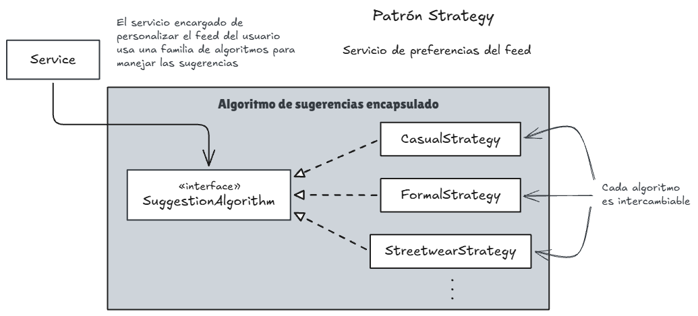

### Observer — diseño propuesto, no implementado

La propuesta contempla notificaciones a compradores cuando se publica una prenda. En el código actual no existen el sujeto, los observadores ni las clases `PublicaciónPrenda` y `UsuarioComprador` descritas originalmente.

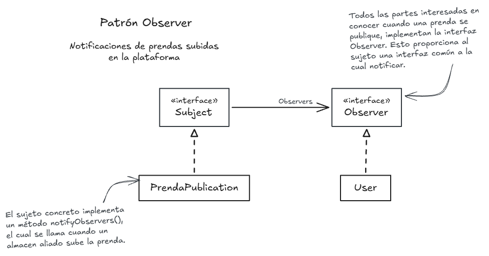

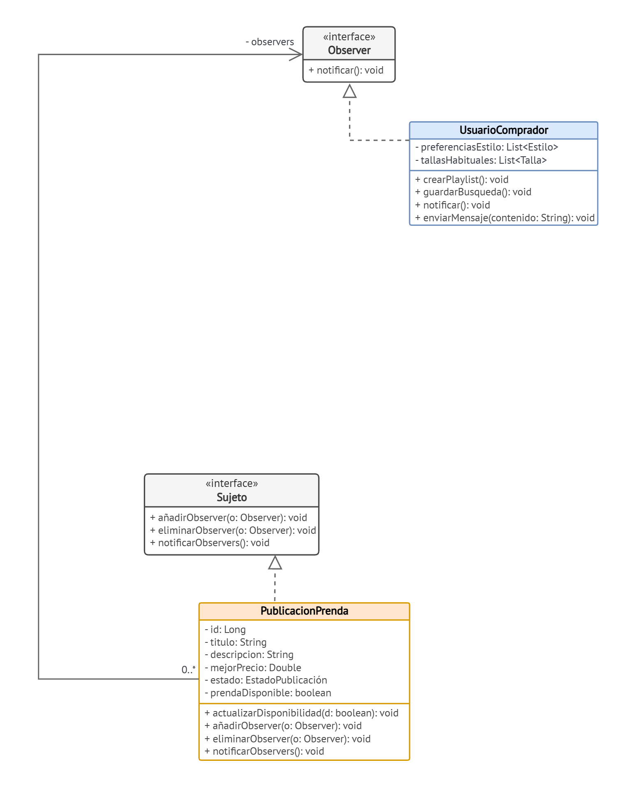

### Adapter — diseño propuesto, no implementado

La propuesta considera adaptar pasarelas de pago y proveedores de IA. Ninguna de esas integraciones pertenece al módulo actual y no existen implementaciones como `ProbadorVirtual` o `AdaptadorGemini`.

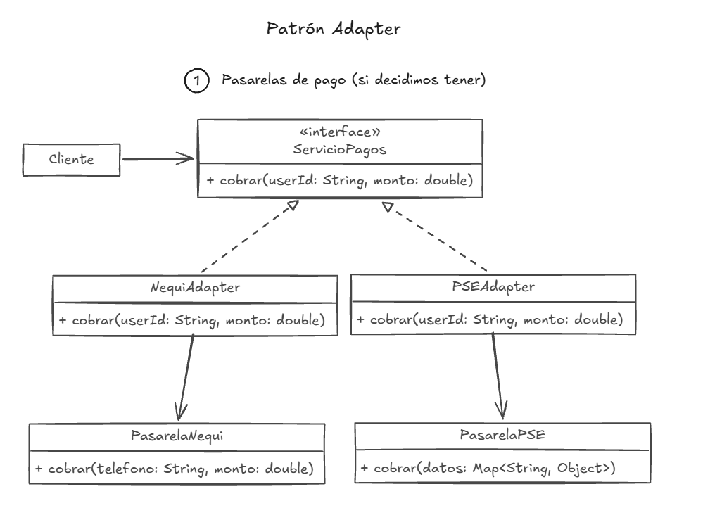

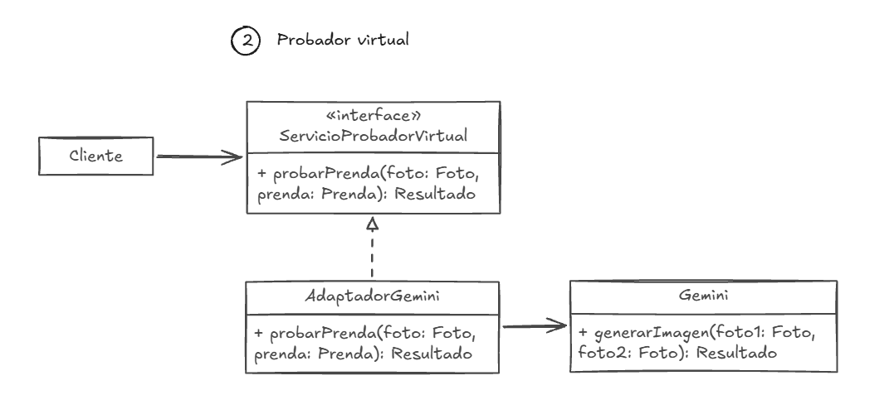

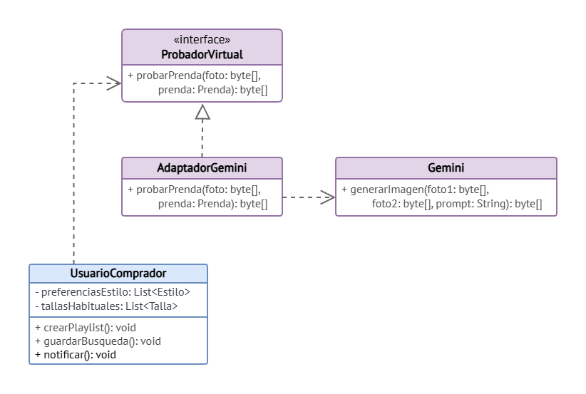

### Composite — composición del framework, no patrón propio implementado

La búsqueda combina filtros con `Specification<ItemCatalogoEntity>` de Spring Data JPA en `ItemCatalogoSpecifications`. Esa composición permite unir predicados con AND y OR, pero el proyecto no define una jerarquía Composite propia como `FiltroTalla`, `FiltroColor` o `FiltroCompuestoAnd`. La ilustración se conserva como diseño conceptual.

El patrón composite nos resuelve el problema de la combinacion de filtros en las búsquedas inteligentes. Con este patrón podemos crear filtros simples como `FiltroTalla` o `FiltroColor`, y filtros complejos como `FiltroCompuestoAnd` (que combina dos filtros) y tratarlos de la misma forma. De esta forma, evaluar si una prenda cumple con un filtro de búsqueda complejo, se vuelve más sencillo. 

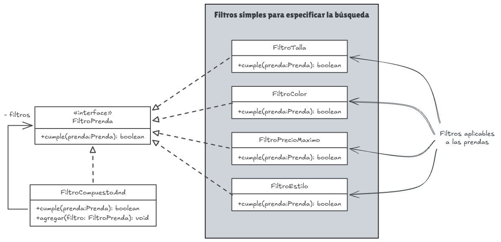

### Iterator — diseño propuesto, no implementado

El código utiliza colecciones, streams y mecanismos de iteración provistos por Java y Spring Data. No existe un iterador personalizado del dominio; la ilustración representa una posibilidad de diseño, no el estado del código.

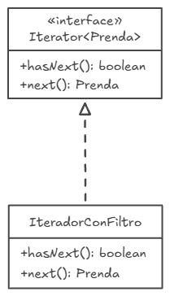

## Trazabilidad funcional del Sprint 2

Durante este Sprint se implementó el módulo de catálogo, inventario y búsqueda de StyleRadar, cubriendo los siguientes requerimientos funcionales:

| Requerimiento | Funcionalidad |
|---|---|
| RF-07 | Búsqueda de prendas mediante texto libre |
| RF-08 | Filtro de prendas por tipo |
| RF-09 | Filtro de prendas por color |
| RF-10 | Filtro de prendas por talla disponible |
| RF-11 | Filtro de prendas por rango de precio |
| RF-12 | Filtro de prendas por marca |
| RF-13 | Filtro de prendas por estilo |
| RF-14 | Ordenamiento de resultados por distancia |
| RF-15 | Ordenamiento por reputación del almacén |
| RF-16 | Consulta de prendas similares cuando no existen coincidencias directas |
| RF-22 | Consulta del catálogo de un almacén |
| RF-50 | Publicación de prendas en el catálogo |
| RF-51 | Registro de fotografías de prendas |
| RF-52 | Registro de tallas disponibles |
| RF-53 | Registro del precio de una prenda |
| RF-54 | Registro de atributos utilizados para búsqueda |
| RF-55 | Edición de prendas del catálogo |
| RF-56 | Actualización de disponibilidad por talla |
| RF-57 | Ocultamiento de prendas agotadas en resultados públicos |
| RF-58 | Retiro de prendas del catálogo |
| RF-59 | Identificación automática de últimas unidades |
| RF-60 | Identificación automática de nuevas llegadas |

### Endpoints principales

El módulo expone, entre otros, los siguientes endpoints:

```text
GET    /api/v1/prendas

GET    /api/v1/almacenes/{nit}/catalogo
POST   /api/v1/almacenes/{nit}/catalogo
PUT    /api/v1/almacenes/{nit}/catalogo/{itemId}
DELETE /api/v1/almacenes/{nit}/catalogo/{itemId}

PUT    /api/v1/almacenes/{nit}/catalogo/{itemId}/tallas
PATCH  /api/v1/almacenes/{nit}/catalogo/{itemId}/inventario/{talla}

POST   /api/v1/almacenes/{nit}/catalogo/{itemId}/imagenes

GET    /api/v1/catalogo/buscar